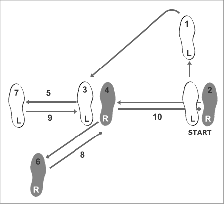
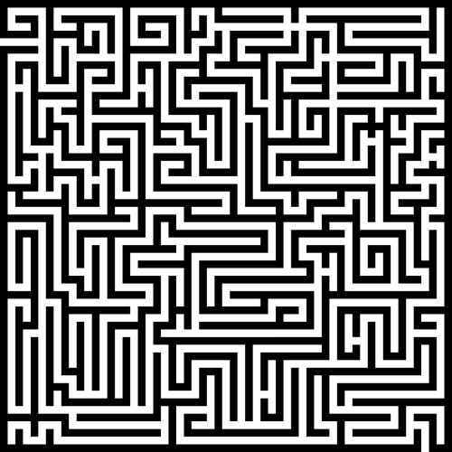
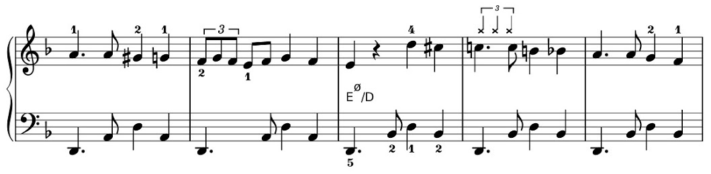
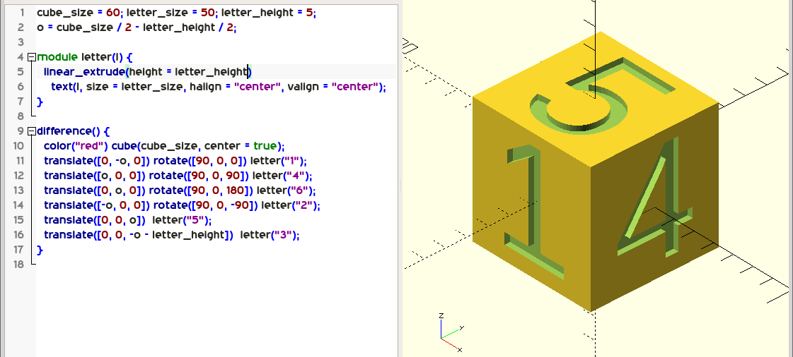

= VL01 Introduction
Ondřej Havel <ondra.havel@gmail.com>
22. November

== Agenda

- https://github.com/ondrah/algo/
- Definition
- Algorithm Types
- Notation and Interpretation
- Complexity
- Output Domain
- Code Review
- Example Algorithm: Digital Root
- Exercises

== Definition

An algorithm is a sequence of steps that describes an approach to a solution of
a given problem. Every computer program that ends with a result is basically
based on a set of algorithms. Algorithms, however, are not just confined for use
in computers and can be used to solve generic tasks.

== Algorithm Types

- Divide and Conquer
- Dynamic
- Recursive
- Greedy
- Backtracking
- Randomized
- Brute Force
- and many others...

Note: larger algorithms usually combine multiple algorithm types

== Divide and Conquer

Divide the algorithm into multiple parts, that contain a sub-problem ideally of
the same type. The combination of sub-solutions leads to the global solution.

Example: merge sort

image::img/vl01_mergesort.png[]

== Dynamic

These algorithms use values computed in the past to compute future results,
boosting efficiency.

Example: Fibonacci numbers

[source,perl]
----
$a = 1; $b = 2;

print "$a, $b, ";

for($i = 0; $i < 10; $i++) {
	$c = $b;
	$b = $b + $a;
	$a = $c;

	print $b, ", ";
}
----

== Recursive

A special type of algorithm using a method of simplification that divides the
problem into sub-problems of the same nature.  The result of one recursion is
the input for the next recursion.  Recursion works in environments where the
algorithm is able to call itself.

image::img/vl01_recursion.jpg[align="center"]

== Backtracking

Class of algorithms for optimization tasks. The algorithm finds a partial solution
candidate on local level with hope that this candidate is a part of the solution
at the global level. Backtracking algorithms typically use recursion.

Example: routing algorithms

== Greedy, Randomized

=== Greedy 

Greedy algorithm usually solve optimization tasks without the guarantee of
finding a solution. The result should be a solution candidate which matches the
requirement of being 'good enough'.

Example: genetic algorithms

=== Randomized

Is a type of algorithm that uses random values in its decisions.

Example: genetic algorithms

== Brute Force

Brute force is the hard way of finding a solution by generating solution
candidates in all possible combinations. Technically, the method always finds
a solution, the real problem is the duration.

Example: password guessing

[source,perl]
----
foreach $l0 ( 'a' ... 'z' ) {
    foreach $l1 ( 'a' ... 'z' ) {
        foreach $l2 ( 'a' ... 'z' ) {
            foreach $l3 ( 'a' ... 'z' ) {
                print $l0, $l1, $l2, $l3, "\n";
            }
        }
    }
}
----

== Notation and Interpretation

- What you essentially do
	* Data transformation
	* Data comparison
	* *Jump* or transition to the next *instruction*
- Plain text preferably with clear instructions
- Usually a pseudocode of a C-like language
	* C, Perl, Java, Python, Basic, and many others

== Complexity

.A small overview
[width="80%",frame="topbot",options="header"]
|====================================================
|Complexity | n = 10 | n = 100 | n = 1000 | n = 10000
|log(n)     | 1 ns   | 2 ns    | 3 ns     | 4 ns
|n*log(n)   | 10 ns  | 100 ns  | 1 us     | 10 us
|n^2^       | 100 ns | 10 us   | 1 ms     | 100 ms
|n^3^       | 1 us   | 1 ms    | 1 s      | 16.7 min
|2^n^       | 1 us   | 10^24^ years | 10^302^ years | 10^3011^ years
|====================================================

_Merge sort has performance/complexity of O(n log n)._

== Output Domain

With the same principles and similar logic, you can work in a completely different
domain.

Try programming 3D models on https://openjscad.org

Hint: search for _openscad cheat sheet_

== If something can go wrong, it will.

- Robustness
- Consistency
- Determinism
- Testing
- Dual Programming
- Code Reviews

== Code Review I

[source,c]
----
int evaluate_pivot(int adj, char *my_string)
{
    int b = adj - 1;
    int idx = b * b;

    if(idx == 0)
    {
        return forward_direction(0, my_string);
    }

    if(idx > 0)
    {
        return forward_direction(+1, my_string);
    }
    
    return forward_direction(-1, my_string);
}
----

== Code Review II

[source,c]
----
/*
 * Generate a random value between a and b, a < b.
 */
int rand_between(int a, int b)
{
    int r;

    do
    {
        r = rand();
    }
    while(r < a || r > b);

    return r;
}
----

== Example: Factorial

[source, c]
----
int factorial(int n)
{   
    if(n <= 1)
        return 1;

    return n * factorial(n - 1);
}
----

== Example: Digital Root

The digital root (also repeated digital sum) of a natural number in a
given number base is the (single digit) value obtained by an iterative process
of summing digits, on each iteration using the result from the previous
iteration to compute a digit sum. The process continues until a single-digit
number is reached. (source: Wikipedia)

Fixed assumption: base = 10

*Example:*

Input 11111, Output 5 (1+1+1+1+1 = 5)

Input 999, Output 9 (9+9+9 = 27 => 2+7 = 9)

Input 68, Output 5 (6+8 = 14 => 1+4 = 5)

== Exercises

- Factorial as a dynamic algorithm
- Lucas Numbers as a recursive algorithm
	* Same principle as Fibonacci, starting with 2, 1
- Tower of Hanoi

image::img/vl01_hanoi.gif[]

- Integer subsequence with the highest sum
	* Example input: 1, 2, 3, -5, 10, 11, -4
	* Expected output: 10, 11
- Bug on a string
	* A bug travels on an elastic string of 1 m initial length. Bug's velocity
	is 1 cm per second. The string stretches at a constant rate 1 m per second. What
	happens and when?
	* Spoiler: link:https://en.wikipedia.org/wiki/Ant_on_a_rubber_rope[]
	* Discrete simplification: Imagine a running metronome with two beats, on
	every beat one the bug goes 1 cm, on every beat two the string length grows 1 m.

