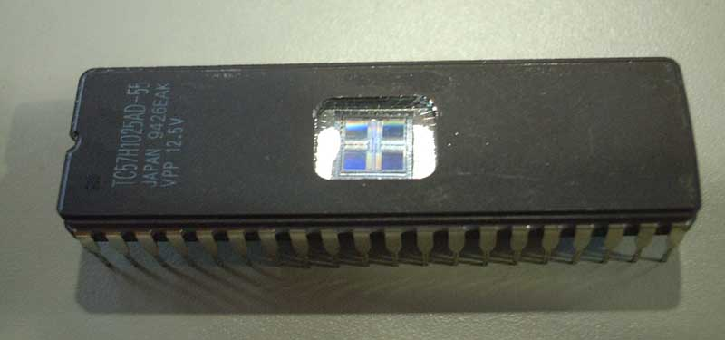

= VL02 Memory and Elementary Types
Ondřej Havel <ondra.havel@gmail.com>
29. November

Data Representation
-------------------

- Memory types
- Memory organization
- Elementary number types
- Data endianness
- Boolean logic
- Binary and hexadecimal radix, conversions

== Memory Types

- RAM - Random Access Memory
  * SRAM - Static RAM - embedded in CPU, registers, cache
  * DRAM - Dynamic RAM - external chips, compacter, slower
- ROM - Read Only Memory
  * PROM - Programmable ROM
  * EPROM - Erasable and Programmable ROM
  * EEPROM - Electrically Erasable and Programmable ROM

- Flash ROM
  * Further developed version of EEPROM
  * Many different types
  * Better flexibility, higher speeds and capacity

.EPROM chip with exposed erase window

== Memory Access - Technical Aspects

- Power consumption
- Access times - write can be significantly slower than read
- Limited cycle count (EEPROM)
- Memory paging (FLASH)
- Memory management (time consumption)

.Example: Atmega328 Datasheet

- 4/8/16/32K Bytes of In-System Self-Programmable Flash program memory
- 256/512/512/1K Bytes EEPROM
- 512/1K/1K/2K Bytes Internal SRAM
- Write/Erase Cycles: 10,000 Flash/100,000 EEPROM
- Data retention: 20 years at 85°C/100 years at 25°C

== Memory Organization

- Byte - smallest addressable unit; 1 B
- Bit - smallest accessible unit; 1 b
- Chunk - smallest exchangeable unit
  * Hardware/memory type specific
  * If used, contains multiple bytes (2, 4)
  * Accessing a single byte might not be the best idea
	. Get a memory chunk
    . Extract a specific byte from there => it could be faster to use larger data types
	. Similar problem as extracting a bit from a byte
- Page - larger organization unit consisting of multiple bytes (4096, 8192, ..)
  * FLASH ROM access asymmetry (device specific):
	** Read anything anywhere
    ** Write chunk on a page only once
    ** Erase the page => now it is possible to write data again

== Elementary number types

- Byte, word, double word, quad word, etc.
- C/Java types: char, short, int, long
  * Take special care - language/compiler specific!
  * Example: sizeof(char), sizeof(short), etc.

[source,c]
----
// A small comparison showing differences between different compilers.
#include <stdio.h>

void main() {
                                        // this  former
    printf("%d\n", sizeof(char));       // 1     1
    printf("%d\n", sizeof(short));      // 2     2
    printf("%d\n", sizeof(int));        // 4     2
    printf("%d\n", sizeof(long));       // 8     4
    printf("%d\n", sizeof(long int));   // 8     4
    printf("%d\n", sizeof(long long));  // 8     4
}
----

- Explicit number types: uint8_t, uint16_t, uint32_t
  * Use for portable code where type size needs to be consistent

[source,c]
----
#include <stdio.h>
#include <stdint.h>

void main() {
	printf("%d\n", sizeof(uint8_t));	// 1
	printf("%d\n", sizeof(uint16_t));	// 2
	printf("%d\n", sizeof(uint32_t));	// 4
	printf("%d\n", sizeof(uint64_t));	// 8
}
----

== Data Endianness

[quote, Wikipedia]
In computing, endianness refers to the order of bytes (or sometimes bits) within
a binary representation of a number. It can also be used more generally to refer
to the internal ordering of any representation, such as the digits in a numeral
system or the sections of a date. 

*LSB, MSB* - Least/Most Significant Byte

.Consider the unsigned hexadecimal number 0x1234.

- requires at least two bytes to represent
- arrangement of the bytes
  * big-endian ordering 0x12, 0x34
  * little-endian ordering 0x34, 0x12

- Type casting, consider uint16_t => uint8_t conversion with little and big
  endian.

== Boolean Operations

[width="80%",frame="topbot",options="header"]
|====================================================
| A		| B		| A AND B | A OR B | A XOR B | NOT A | NOT B
| 0		| 0		|	0	  |	0	   | 0		 | 1	 |	1
| 0		| 1		|	0	  |	1	   | 1		 | 1	 |	0
| 1		| 0		|	0     |	1      | 1		 | 0	 |	1
| 1		| 1		|	1     | 1      | 1		 | 0	 |	0
|====================================================

- Complementary operations: nand, nor, nxor
- AND
   * binary multiplication
   * A AND A, A && B
- OR
   * inclusive binary addition
   * A OR B, A || B
- NOT
   * unary operation
   * NOT(A), !A
- A XOR B = (!A && B) || (A && !B)

== Boolean Expressions

- Right to left interpretation (C-based languages)

- Programming essentials: simplify/negate logical expressions

[source,c]
----
/* one way */
if(is_engine_ready() && test_engine()) {
    start_engine();
} else {
    do_something_else();
}

/* or another */
if(!is_engine_ready() || !test_engine()) {
    do_something_else();
} else {
    start_engine();
}
----

- Avoid tautology and contradiction

[source,c]
----
if(a == 1 || a != 1) {

}
----

- Might be handy for easily de-activating a block of code during the development.

[source,c]
----
if(0) { // equivalent if(false) {
// this block is now deactivated
}

if(1) { // equivalent if(true) {
// yes, this shall run
}
----

== Bitwise Operations

- Counterparts of binary operations applied on whole numbers.

[width="80%",frame="topbot",options="header"]
|====================================================
| A		    | B		    | A AND B | A OR B | A XOR B | NOT A | NOT B
| 10001111	| 11010000	| 10000000 | 11011111 | 11011111 | 01110000	 |	00101111
|====================================================

- A AND B; A & B
- A OR B; A | B
- NOT(A); ~A
- SHL <<, SHR >>

== Code Review I

- What does the code do and why?
- Convert the values of a and b to hexadecimal

[source,c]
----
int a = 100;
int b = 160;

a = a ^ b;
b = a ^ b;
a = a ^ b;
----

== Exercise 0

Implement an algorithm:

Input: unsigned integer value
Ouput: number of bits with value 1 in its binary representation

== Exercise 1

Consider the following code snippet in Basic.
How would the Java/C counterpart look like?

----
While row < lastrow
    For i As Integer = 0 To lastcol
        If i = 5 Then
            Continue While
        End If
    Next i
End While
----

== Exercise 2

Implement and write an algorithm!

Iterate the following transformations with input data:

- Replace every 0 with 1 and replace every 1 with 10
  * Example: 101 => 10110
- Use the newly created data for the next iteration

Use 0 as initial input. What can be seen?
