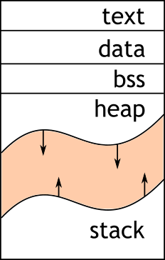
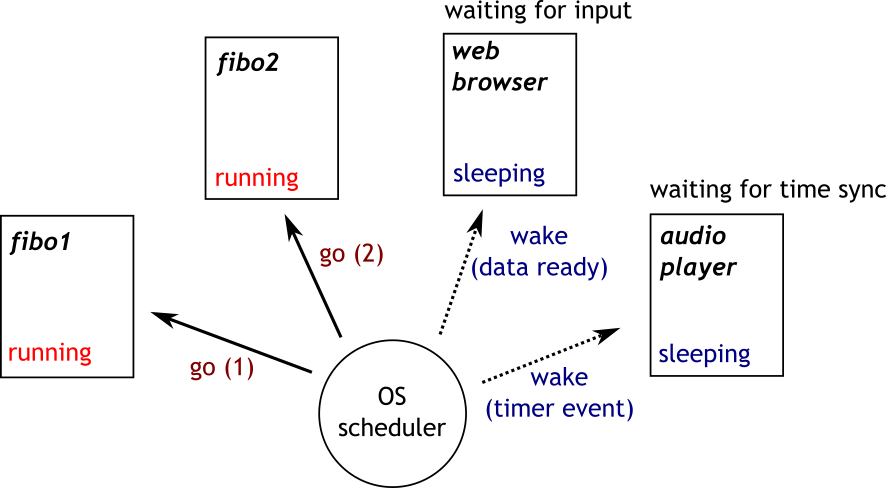
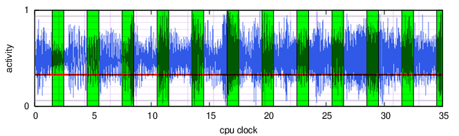
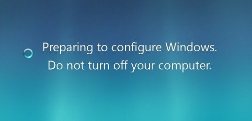

= VL04 Operating Systems
13. December

== Agenda

- Low Level Programming
- Algorithm Instantiated
- Operating systems
- OS: Memory Management
- OS: Task Management
- Exercises

== Low Level Programming

image::img/vl04_problem_factory.jpg[]

  - C is a low-level language while JAVA is a high-level language
  - Pointer go backstage in JAVA while C requires explicit handling of pointers
    * Variable reference can be declared as *int *variable* (* denotes the address of a
    variable)
    * Address of any variable can be obtained via *&variable*

.Example: referencing and dereferencing
[source,c]
----
int my_int1 = 100;
int my_int2 = 200;
int *addrA = &my_int1;
int *addrB = &my_int2;

*addrA = 150;	// my_int1 is now 150
*addrB = 150;	// my_int2 is now also 150

if(*addrA == *addrB) {
	printf("True story now\n");
}

if(addrA != addrB) {
	printf("Also a true story!\n");
}

if(sizeof(char *) == sizeof(int *)) {
	printf("Indeed a true story!\n");
}
----

.Example: typical use of a pointer
[source,c]
----
char *str = "This old house";

while(*str != '\0') {
	putc(*str);		// print a single character at address str
	str++;			// increase the address 1 character further

	// in shorter notation written as putc(*str++);
}
----

.Example: determine machine's endianness
[source,c]
----
#include <stdio.h>

int main()
{
    __uint16_t word = 0x1234;

    if(((__uint8_t *)&word)[0] == 0x12) {
        printf("This seems to be a BIG ENDIAN machine.\n");
    } else {
        printf("This seems to be a LITTLE ENDIAN machine.\n");
    }

    return 0;
}
----

== Program Sections

- Text

A code segment, also known as a text segment or simply as text, is
a portion of an object file or the corresponding section of the program's
virtual address space that contains executable instructions.

- Data

The data section contains pre-defined data.

- BSS - Block Started by Symbol

Also known as _Better Save Space_. The BSS segment only holds variables that don't have
any defined value yet. Before program start, this segment is usually zeroed.
Obviously, the segment does not need to take any space in the executable file.

- Heap

Dynamically allocated memory area by the operating system. The size of heap can
be controlled during the runtime. The application is responsible for allocating
and freeing memory. No garbage collection takes place.

- Stack

Dynamic memory area for passing arguments, calling functions,
return addresses (return from a function), and local function variables.
A stack usually grows in opposite direction (contrary to the heap), its position in
RAM is also specific.

.Typical use of heap
[source,c]
----
#include <stdlib.h>

char *my_string = (char *)malloc(16);
// do something here with my_string
// finally, release the allocated space
free(my_string);
// *my_string should not be accessed anymore!
----

.A lesser good idea
[source,c]
----
#include <stdlib.h>

char *my_string2;
for(;;) {
	my_string2 = (char *)malloc(16);
	// this leads to a crash on 'out of memory' exception
	// compare with a garbage collection system
}
----

== Algorithm Instantiated

.Decide which line belongs to which section

[source,c]
----
int a = 1;
int b = 1;
int res;

int main()
{
        for(int i = 0 ; i < 10; i++) {
                res = a + b;
                b = a;
                a = res;
        }

        return res;
}
----

What happens at the lowest level?

- Jump
- Move numbers
- Transform numbers
- Compare numbers

Self study:

- Alan Turing, Turing Machine

.Decompiled program (have a look at the atomic operations)
----
00000000000005fa <main>:
int a = 1;
int b = 1;
int res;

int main()
{
 5fa:   55                      push   %rbp
 5fb:   48 89 e5                mov    %rsp,%rbp
        for(int i = 0 ; i < 10; i++) {
 5fe:   c7 45 fc 00 00 00 00    movl   $0x0,-0x4(%rbp)
 605:   eb 30                   jmp    637 <main+0x3d>
                res = a + b;
 607:   8b 15 03 0a 20 00       mov    0x200a03(%rip),%edx        # 201010 <a>
 60d:   8b 05 01 0a 20 00       mov    0x200a01(%rip),%eax        # 201014 <b>
 613:   01 d0                   add    %edx,%eax
 615:   89 05 01 0a 20 00       mov    %eax,0x200a01(%rip)        # 20101c <res>
                b = a;
 61b:   8b 05 ef 09 20 00       mov    0x2009ef(%rip),%eax        # 201010 <a>
 621:   89 05 ed 09 20 00       mov    %eax,0x2009ed(%rip)        # 201014 <b>
                a = res;
 627:   8b 05 ef 09 20 00       mov    0x2009ef(%rip),%eax        # 20101c <res>
 62d:   89 05 dd 09 20 00       mov    %eax,0x2009dd(%rip)        # 201010 <a>
        for(int i = 0 ; i < 10; i++) {
 633:   83 45 fc 01             addl   $0x1,-0x4(%rbp)
 637:   83 7d fc 09             cmpl   $0x9,-0x4(%rbp)
 63b:   7e ca                   jle    607 <main+0xd>
        }

        return res;
 63d:   8b 05 d9 09 20 00       mov    0x2009d9(%rip),%eax        # 20101c <res>
}
 643:   5d                      pop    %rbp
 644:   c3                      retq   
----

== Operating Systems

An operating system (OS) is system software that manages computer hardware,
software resources, and provides *common services* for computer programs.

- Memory/heap management
- Task/process management
- Real time clock
- Access control of any kind
- File system, networking and other I/O

== OS: Memory Management

  - Dynamic data types, consider `myString += " can be now longer";`
  - Application -> VRAM -> MMU -> RAM
  - MMU - Memory Management Unit (part of CPU)

image::img/vl04_vram.png[]

== OS: Task Management

  - Concurrency - time multiplex, preemptive multitasking
  - Real time clock
  - Interrupt - timer event, data received/transmitted
  - CPU load, CPU time
    * System load averages is the average number of processes that are 
    in a runnable state usually computed for the past 1, 5, and 15 minutes.
  - OS scheduler performs task switching and gives the illusion of
    concurrency.

.Example: Processing sound data in real time

  The following figure shows GSM compression of human speech (blue). The CPU activity is marked green. Horizontal red line shows CPU load estimate.

== OS: Is this really necessary?

== Not really...

Go programming bare-metal with link:http://arduino.cc/[].

- RAM is only a few KB but start time under 1 ms
- OS is not really that fast
- Hardware price far below $10
- Software for free

image::img/vl04_arduino_uno.jpg[width="60%"]

== Exercise 0

Develop a calculator application. The calculator takes a simple arithmetic 
expression at the input, performs its validation and calculation, finally, the
result is printed.

Example: 

- Input: (1+2+3)\*4*(10-20)
- Output: -240

Discuss the selected algorithm type and data structures used.

Inspiration: Have a look at java.math.BigInteger.

== Exercise 1

Write a quine in your favorite programming language!

A quine is a computer program which takes no input and produces a copy of its
own source code as its only output.
