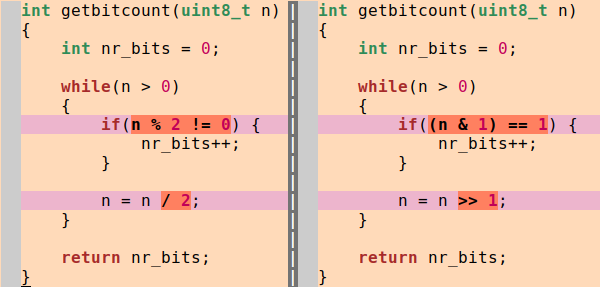
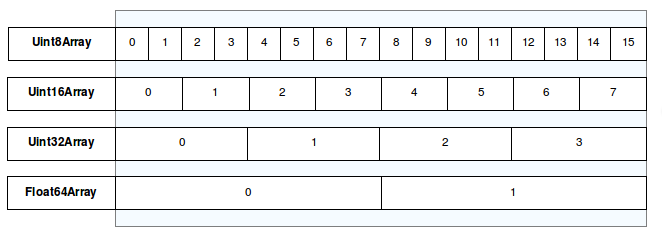
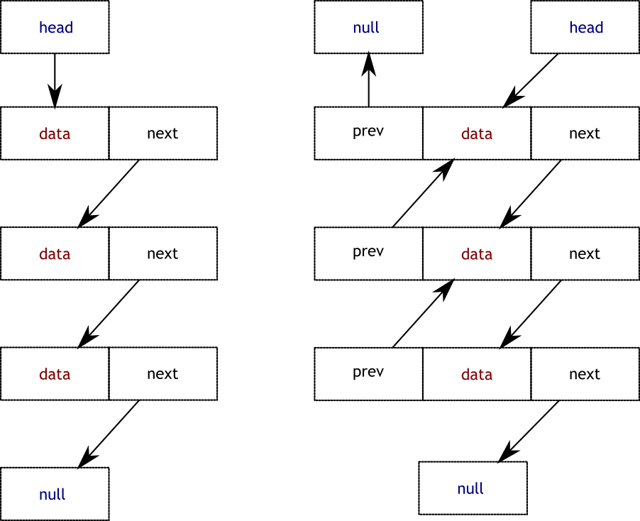

= VL05 Dynamic Data Types 
20. December

== Agenda

- String
- Array
- List
- Stack and Queue
- Hash
- Dictionary

== String

.Interpolation
String interpolation is a mechanism to replace values inside a string with
variables or expressions. In Java, see `String.format()`.

[source,csharp]
----
string customGreeting = "Hello";
string customName = "Dolly";

// interpolation with plain variables
string myString = $"{customGreeting}, {customName}!";

// interpolation with expressions
string myString2 = $"{customGreeting.ToUpper()}, {customName.ToUpper()}!";
----

The `+` operator is commonly used to "add" strings. The addition actually means
*concatenation*.

[source,csharp]
----
string myString = "NEVER ODD";

// you can do
myString += " OR EVEN";

// but you probably cannot do
myString -= " OR EVEN";
----

A similar mechanism could be useful for dealing with files and algorithms.

Example: initial version of `getbitcount` using modulo and integer division.

[source,c]
----
int getbitcount(uint8_t n)
{
	int nr_bits = 0;

	while(n > 0)
	{
		if(n % 2 != 0) {
			nr_bits++;
		}

		n = n / 2;
	}

	return nr_bits;
}
----

A slightly improved version.

[source,c]
----
int getbitcount(uint8_t n)
{
	int nr_bits = 0;

	while(n > 0)
	{
		if((n & 1) == 1) {
			nr_bits++;
		}

		n = n >> 1;
	}

	return nr_bits;
}
----

What is the difference? (Human and computer readable.)

----
--- file1.c	2019-12-19 21:59:42.201988361 +0100
+++ file2.c	2019-12-19 21:59:02.510397146 +0100
@@ -4,11 +4,11 @@
 
 	while(n > 0)
 	{
-		if(n % 2 != 0) {
+		if((n & 1) == 1) {
 			nr_bits++;
 		}
 
-		n = n / 2;
+		n = n >> 1;
 	}
 
 	return nr_bits;
----

The difference file makes basic arithmetic operations on files possible and it
is also a rudimentary function of present version control systems.

.Patch operations (applying a diff file)
[source,c]
----
source_file + diff_file = updated_file
updated_file - diff_file = source_file
----

Self study: version control system

== Array

Array is a collection of homogeneous elements.

.Static declaration of single and multi-dimensional arrays
[source,c]
----
int single_array[4];

int multi_2[4][4];

int multi_3[4][4][4];
----

Size and structural modification of an array is not simple to do.

Consider memory allocation problems if inserting a new element.

== List

List is a collection of elements in a sequence where each element is an object
instance and elements can be accesses either via an iterator or via index
number. A list is a dynamic structure that can grow and shrink easily.

A modern programming language usually defines elementary list operations.

Consider modalities in different implementations:

- Single linked list
- Double linked list
- Terminated and circular

=== LIFO: Last In First Out

A.k.a. stack, easy implementation with an array.

image::img/vl05_lifo.png[]

Use cases: call stack, order reversal, undoing transactions

=== FIFO: First In First Out

Typical implementation with a list or as a circular buffer in an array.

image::img/vl05_fifo.png[]

Use cases: queuing requests

Self study: circular buffer

== Example: Data Lookup

What is the speed difference between searching in an unsorted and sorted data
set?

----
2515 8870 4202 9202 360 3437 4633 3127 9717 2653 390 1915 1896 7079 6998 582
8820 3122 569 8578 5610 6585 2337 3716 6758 763 1730 8335 9725 122 6761 5188
1159 8566 5550 3360 3568 4123 5517 1368 9794 5858 1315 4196 290 582 556 8472
3569 5704 8442 9270 3700 4737 1736 8511 3881 5527 6403 8020 1520 514 6281 5536
5434 8001 6362 4212 8388 3599 9667 1147 9819 9354 1963 8417 1978 2337 1261 7118
3543 5299 6345 6413 4688 4802 9683 2087 6541 500 8684 3281 1574 6303 6167 8776
3690 6159 6351 1389
----

----
122 290 360 390 500 514 556 569 582 582 763 1147 1159 1261 1315 1368 1389 1520
1574 1730 1736 1896 1915 1963 1978 2087 2337 2337 2515 2653 3122 3127 3281 3360
3437 3543 3568 3569 3599 3690 3700 3716 3881 4123 4196 4202 4212 4633 4688 4737
4802 5188 5299 5434 5517 5527 5536 5550 5610 5704 5858 6159 6167 6281 6303 6345
6351 6362 6403 6413 6541 6585 6758 6761 6998 7079 7118 8001 8020 8335 8388 8417
8442 8472 8511 8566 8578 8684 8776 8820 8870 9202 9270 9354 9667 9683 9717 9725
9794 9819
----

Hint: binary search

== Hash

A hash (HashSet class) provides high-performance set operations. A set is a
collection that contains no duplicate elements, and whose elements *are in no
particular order*. Typically, the `Contains` method is primarily used to
determine if an element is present or not. Some higher programming languages do
not implement the HashSet class. The Dictionary class can be used as a
substitute.

[source,csharp]
----
HashSet<int> evenNumbers = new HashSet<int>();
HashSet<int> oddNumbers = new HashSet<int>();

for (int i = 0; i < 5; i++)
{
    // Populate numbers with just even numbers.
    evenNumbers.Add(i * 2);

    // Populate oddNumbers with just odd numbers.
    oddNumbers.Add((i * 2) + 1);
}

Console.Write("evenNumbers contains {0} elements: ", evenNumbers.Count);
DisplaySet(evenNumbers);

Console.Write("oddNumbers contains {0} elements: ", oddNumbers.Count);
DisplaySet(oddNumbers);
----

== Dictionary

The Dictionary<TKey,TValue> generic class provides a mapping from a set of keys
to a set of values. Each addition to the dictionary consists of a value and its
associated key. Retrieving a value by using its key is very fast, close to O(1),
because the Dictionary<TKey,TValue> class is implemented as a hash table.

The speed of retrieval depends on the quality of the hashing algorithm of the
type specified for TKey.

[source,csharp]
----
// Create a new dictionary of strings, with string keys.

Dictionary<string, string> openWith = 
    new Dictionary<string, string>();

// Add some elements to the dictionary. There are no 
// duplicate keys, but some of the values can be duplicates.
openWith.Add("txt", "notepad.exe");
openWith.Add("bmp", "paint.exe");
openWith.Add("rtf", "wordpad.exe");
openWith.Add("dib", "paint.exe");

// The Add method throws an exception if the new key is 
// already in the dictionary.
try
{
    openWith.Add("txt", "winword.exe");
}
catch (ArgumentException)
{
// Sorry, element already exists.
}

// This is usually very fast
if(openWith.ContainsKey("txt")) { }

// And this is usually not that fast
if(openWith.ContainsValue("notepad.txt") { }
----

== Exercise 0: The Sieve

Implement the Sieve of Eratosthenes. In mathematics, the Sieve of Eratosthenes
is a simple, ancient algorithm for finding all prime numbers up to any given
limit. 

image::img/vl05_sieve.gif[width="40%"]

== Exercise 1: Maze Generator

Develop a simple square maze generator as a randomized algorithm.

Input: *n* square base size

Example:

- input: n = 8
- output:

----
# ######
# #    #
#   ## #
# ######
# #   ##
# # #  #
#   ## #
###### #
----

== Exercise 2: Party Invitation!

image::img/vl05_party.jpg[]

Consider there are *n* people at your party, how high is the probability that
there is another person with the same birthday date (month/day) as you have?

Consider for arbitrary *n*!

