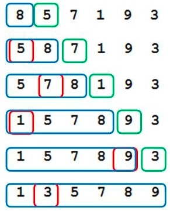
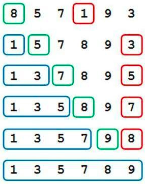
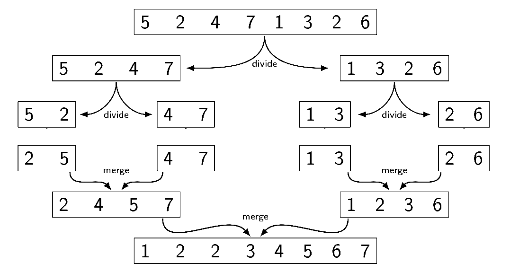
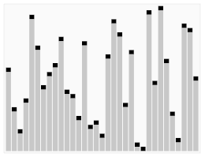

= VL06 Sort Methods
10. January

== Agenda

- Shuffle
- Sort

== Randomization

To shuffle an array a of n elements we use the Fisher-Yates algorithm.

[source,c]
----
for i from n-1 downto 1 do {
     j = random integer such that 0 ≤ j ≤ i;
     exchange(a[j], a[i]);
}
----

== Bubble Sort

A simple sorting method, compare all possible neighbors, swap them if necessary.
Repeat that long enough.

[source,c]
----
for(int i = 0; i < a.length - 1; i++) {
	for(int j = 0; j < a.length - 1; j++) {
		if(a[j] > a[j + 1]) {
			int temp = a[j];
			a[j] = a[j + 1];
			a[j + 1] = temp;
		}
	}
}
----

A slightly optimized version which terminates if input is already sorted or
sorted prematurely.

[source,c]
----
for(int i = 0; i < a.length - 1; i++) {
	bool flDidSwap = false;

	for(int j = 0; j < a.length - 1; j++) {
		if(a[j] > a[j + 1]) {
			flDidSwap = true;

			int temp = a[j];
			a[j] = a[j + 1];
			a[j + 1] = temp;
		}
	}

	if(!flDidSwap)
		break;
}
----

== Insertion Sort

- There are two areas in the array: sorted and unsorted
- Take the first unsorted element
- Find an appropriate place (make place by moving other elements)
- Adjust size of the sorted/unsorted area

Imagine sorting a handful of playing cards.

== Selection Sort

- There are two areas in the array: sorted and unsorted
- Find the maximum/minimum in the unsorted area
- Swap it with the leftmost/rightmost element
- Adjust size of the sorted/unsorted area

== Heap Sort

Efficient, general-purpose sorting algorithm which uses a binary heap.

- Turn the input list into a binary tree
  * Parent node is always greater (smaller) than its children

- Take the parent and place it into the sorted area
- Reorganize the tree
- Repeat until sorted

image::img/vl06_heap_sort_0.gif[]
image::img/vl06_heap_sort.gif[]

== Merge Sort

Efficient, general-purpose sorting algorithm.

[source,java]
----
public static int[] intArr = { 5, 2, 4, 7, 1, 3, 2, 6 };

public int[] sort(int l, int r) {
	if (l < r) {
		int q = (l + r) / 2;
		
		sort(l, q);
		sort(q + 1, r);
		merge(l, q, r);
	}
	return intArr;
}

private void merge(int l, int q, int r) {
.
.
.
}

public static void main(String[] args) {
	Mergesort ms = new Mergesort();
	int[] arr = ms.sort(0, intArr.length - 1);
	.
	.
----

== Quicksort

Quicksort is a fast sorting algorithm widely applied in practice. On the
average, it has O(n log n) complexity, making quicksort suitable for sorting big
data volumes. 

Divide-and-conquer and recursion is used in quicksort.

. Choose a pivot value, typically the middle element, can be a random element.
. Rearrange elements in such a way, that all elements which are lesser than the pivot go to the left part of the array and all elements greater than the pivot, go to the right part of the array.
. Recursion: apply the quicksort algorithm to the left and the right parts.

[source,c]
----
void quicksort(array) {
    if(length(array) <= 1)
		return;

	pivot = select any element of array;
	left = first index of array;
	right = last index of array;
	while(left ≤ right) {
		while(array[left] < pivot)
			left = left + 1;
		while(array[right] > pivot)
			right = right - 1;
		if(left ≤ right) {
			swap array[left] with array[right];
			left = left + 1;
			right = right - 1;
        }
    }
	quicksort(array from first index to right);
	quicksort(array from left to last index);
}
----

== Comparison

[width="80%",frame="topbot",options="header"]
|====================================================
|Algorithm	|	Time complexity:Best	|	Time complexity:Average | Time complexity:Worst |	Space complexity:Worst
|Quicksort	| O(n log(n)) |	O(n log(n)) | O(n^2^) |O(n)
|Merge sort	| O(n log(n)) | O(n log(n))	| O(n log(n)) |O(n)
|Heap sort	 | O(n)	| O(n log(n)) |O(n log(n)) |O(1)
|Bubble sort | O(n)	| O(n^2^) | O(n^2^) |O(1)
|Insertion sort | O(n) | O(n^2^) | O(n^2^) | O(1)
|Selection sort	| O(n^2^)	| O(n^2^)	| O(n^2^)	| O(1)
|====================================================

== Exercise 0: Search and Sort!

Write a simple maze evaluator/solver!

- Find all maze entries, mark first two as A and B
- Decide whether there is at least one route between A and B
- Optional:
  * Determine how many different routes are available
  * If there are multiple routes, find the shortest one

- Example Input:
----
# ######
# #    #
#   ## #
# ######
# #   ##
# # #  #
#   ## #
###### #
----

- Example Output:
  * 1 path
  * Path 1: 17 squares
