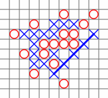

= VL07 Data Transformations
17. January

== Agenda

- Maze Solver
- Sorting: Reprise
- Run-Length Encoding
- LZW Compression
- Huffman Encoding

== Maze Solver

. Data consistency check
. Lookup entry and exit
. Recursive walk-through
. Print result

.Example input
----
█ ███████
█ █     █
█ ███ ███
█   █   █
███ ███ █
█ █     █
█ █████ █
█       █
███████ █
----

.Models for Further Consideration
----
█ ███████  █ ███████
█ █     █  █ █     █
█ ███ ███  █ ███ ███
█   █   █  █   █   █
███ ███ █  ███ ███ █
█ █     █  █       █
█ █ ███ █  █     █ █
█       █  █       █
███████ █  ███████ █
----

== Sorting: Reprise

.Know-how
- Compare and swap
- Empty array and single-element array are sorted
- Idempotence

.Specific Algorithms
- Array merging
- Priority queue/binary heap
  * Recursive phase
  * Linear phase

== Run-Length Encoding (RLE)

Run-length encoding is a form of lossless data compression in which runs
of data (sequences in which the same data value occurs in many consecutive data
elements) are stored as a single data value and count, rather than as the
original run. 

- Example input: AAAAAAAAAABBBBB
- Example output: 10A5B

- Example input: ABCABCABC
- Example output: 1A1B1C1A1B1C1A1B1C

Exercise 0: Write a RLE compressor and de-compressor.

== LZW Compression

The Lempel-Ziv-Welch algorithm provides loss-less data compression. It was
published by Welch in 1984 as an improved implementation of the original LZ78
algorithm published by Lempel and Ziv in 1978. The algorithm entered the public
domain in 2004.

.Compression
[source,csharp]
----
Dictionary<string, int> our_dictionary = new Dictionary<string, int>();

/* prepare initial dictionary */
for(int i = 0 ; i < 256; i++) our_dictionary.Add(((char)i).ToString(), i);

string w = "";	/* empty string */
while (char c = get_next_uncompressed_character())
{
    if (our_dictionary.ContainsKey(w + c))
    {
        w = w + c;
    }
    else
    {
        output(our_dictionary[w]);

        our_dictionary.Add(w + c, our_dictionary.Count);
        w = c;
    }
}

if(w != "")
    output(our_dictionary[w]);
----

Example input: abcabcabc

[width="80%",frame="topbot",options="header"]
|====================================================
| Extra dictionary entries | Output
| ab => 256      |    97,
| bc => 257      |    98,
| ca => 258      |    99,
| abc => 259     |    256,
| cab => 260     |    258,
| bc => 261      |    257,
|====================================================

.Decompression
[source,csharp]
----
Dictionary<int, string> our_dictionary = new Dictionary<int, string>();

/* prepare initial dictionary */
for(int i = 0 ; i < 256; i++) our_dictionary.Add(i, ((char)i).ToString());

string w = ((char)get_next_compressed_int()).ToString();
string result = w;

while (int c = get_next_compressed_int())
{
    string entry;

    if (our_dictionary.ContainsKey(c)) {
        entry = our_dictionary(c);
    } else {
        throw new Exception("Badly compressed data!");
    }

    result = result + entry;
    
    our_dictionary.Add(our_dictionary.Count, w + entry.SubString(0,1));

    w = entry;
}

output($result);
----

== Huffman Encoding

Huffman encoding is a way to assign binary codes to used symbols (characters).
Its aim is to map each character to its shortest binary representation in scope
of the complete input. Symbols that are used often get shorter binary
representation, less often symbols are encoded with longer code.

.Example input = "mississippi"

[width="80%",frame="topbot",options="header"]
|====================================================
| Occurence | Character | Binary Code
|2x | 'p' | 101
|4x | 's' | 0
|1x | 'm' | 100
|4x | 'i' | 11
|====================================================

Result: *100110011001110110111* (that is 21 bits vs. 88 bits but don't forget you
need to define the dictionary)

The Huffman coding scheme takes each symbol and its frequency of
occurrence, and generates proper encoding for each symbol *taking account of
the weights of each symbol*, so that higher weighted symbols have fewer bits in
their encodings.

The algorithm:

. Create a leaf node for each symbol and add it to the priority queue (see
`java.util.PriorityQueue`, heap sort)
. While there is more than one node in the queue:
  - Get two nodes by removing the node with the lowest probability twice
  - Create a new internal node with these two nodes as children and with
    probability equal to the sum of the two nodes' probabilities
  - Put the new node back to the queue
. There's a single node in the queue

Paths in the constructed binary tree from root to leaves make the resulting
code. Accumulate 0 for each transition to the left and 1 for transitions to the
right side.

.Example input "abcd"

[width="80%",frame="topbot",options="header"]
|====================================================
| Occurence | Character | Binary Code
|1x | 'a' | 10
|1x | 'b' | 11
|1x | 'c' | 00
|1x | 'd' | 01
|====================================================

.Example input "aaabcd"

[width="80%",frame="topbot",options="header"]
|====================================================
| Occurence | Character | Binary Code
|3x | 'a' | 0
|1x | 'b' | 10
|1x | 'c' | 110
|1x | 'd' | 111
|====================================================

== Exercise 1: Tic Tac Toe

Write a simple player algorithm for the tic-tac-toe game!
The playground is represented by a two-dimensional array.
Consider also larger playgrounds (99x99) and `nr_winning = 5`.

[source,java]
----
/**
 * The function performs one tic-tac-toe turn on provided playground.
 * The turn is performed by writing player_id at empty field on the
 * playground. Empty field is represented by a space character. 
 *
 * @param player_id   Player identification, a non-space character.
 *                    This argument is constant within one game.
 * @param nr_winning  Number of consecutive marks required to win.
 *                    This argument is constant within one game.
 * @param playground  Input/output structure containing the game.
 *                    Only empty fields can be used for the turn.
 */
void play(char player_id, int nr_winning, char[][] playground) {

}
----
