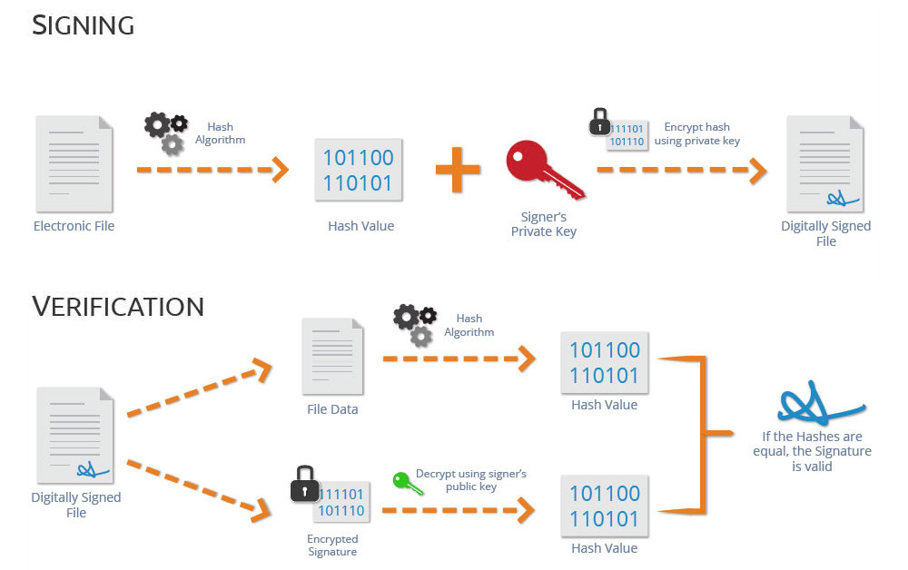

= VL08 Communication
24. January

== Agenda

- Digital Communication
- Data Integrity
- Hash Algorithm
- Digital Signature
- Data Serialization
- Probeklausur

== Digital Communication

Electronic transmission of information that has been encoded digitally.
Transferring data from one place to another. It is done by physical path or
physical connection. In digital communication, digital values are taken as the
discrete set.

.Example: Serial Communication

image::img/vl08_communication.png[]

- communication speed: 9600 bps (bits per second, baud)
- 1 bit duration (@9600 baud) = appx. 104 us
- bit order: LSB to MSB
- parity: none, odd, even
- stop bit length: 1, 1.5, 2

How long does it take for one byte?

== Data Integrity

.Longitudinal Redundancy Check
International standard ISO 1155 states that a longitudinal redundancy check
for a sequence of bytes may be computed in software by the following algorithm: 

[source,c]
----
lrc = 0
for each byte b in the buffer
    lrc = (lrc + b) AND 0xFF

lrc = (((lrc XOR 0xFF) + 1) AND 0xFF)
----

.Integrity checking

[source,c]
----
check = 0
for each byte b in the buffer with lrc do
    check = (check + b) and 0xFF

if(check == 0) then
	print "Data might be OK";
else
	print "Data or checksum is broken";
end if
----

== Hash Function

Motivation: comparison, error detection, cryptography

A function that converts a given big phone number to a small practical integer
value. The mapped integer value is used as an index in the hash table. In
simple terms, a hash function maps a big number or string to a small integer
that can be used as the index in the hash table.

A good hash function should have the following properties:

. Efficiently computable
. Should uniformly distribute the keys (Each table position equally likely for each key)

To calculate cryptographic hashing value in Java, the `MessageDigest` class is
used, under the package `java.security`.

The `MessageDigest` class provides following cryptographic hash function to find
hash value of a text, they are:

. MD5
. SHA-1
. SHA-256

== Digital Signature

== Data Serialization

Data serialization is the process of converting data objects present in 
data structures into a byte stream for storage or transmission. The reverse
process of converting a byte stream into a data structure is data
deserialization.

.JAVA Example

First, there is a class with serializable data. The class has to implement the
`Serializable` interface.

[source,java]
----
import java.io.Serializable;

public class Student implements Serializable {
    int matNr;
    String name;

    public Student(int matNr, String name) {
        this.matNr = matNr;
        this.name = name;
    }
}
----

If there is data, it can be written to a file. There are several aspects to
check, file permissions, available space, etc. The serialization block is
usually closed in a try/catch block.

[source,java]
----
import java.io.*;

class StoreData {
    public static void main(String args[]) {
        try {
            // Creating the object
            Student s1 = new Student(851, "Edward Woodward");

            // Creating a stream and writing the object
            FileOutputStream fout = new FileOutputStream("serialized.txt");
            ObjectOutputStream out = new ObjectOutputStream(fout);

            out.writeObject(s1);
            out.flush();

            //closing the stream
            out.close();

            System.out.println("successfully serialized");
        } catch(Exception e) {
            System.out.println(e);
        }
    }
}
----

Deserialization is the process of reconstructing the object from the serialized
state. It is the reverse operation of serialization. For similar reasons, the
logic is embedded in a try/catch block.

[source,java]
----
import java.io.*;

class LoadData {
    public static void main(String args[]) {
        try {
            // Create stream and deserialize the input file
            ObjectInputStream in =
                new ObjectInputStream(new FileInputStream("serialized.txt"));

            Student s = (Student)in.readObject();

            System.out.println(s.id + " " + s.name);
            in.close();
        } catch(Exception e) {
            System.out.println(e);
        }
    }
}
----

.Example: JSON

JavaScript Object Notation is an open-standard file format or data interchange
format that uses human-readable text to transmit data objects consisting of
attribute–value pairs and array data types. 

----
{
   "operation" : "*",
   "left" : {
      "right" : 4,
      "left" : {
         "left" : {
            "left" : 1,
            "right" : 2,
            "operation" : "+"
         },
         "right" : 3,
         "operation" : "+"
      },
      "operation" : "*"
   },
   "right" : {
      "left" : 10,
      "right" : 20,
      "operation" : "-"
   }
}
----

.Example: YAML Ain't Markup Language
YAML is a human friendly data serialization standard for all programming languages. 

----
left:
  left:
    left:
      left: 1
      operation: +
      right: 2
    operation: +
    right: 3
  operation: '*'
  right: 4
operation: '*'
right:
  left: 10
  operation: '-'
  right: 20
----

