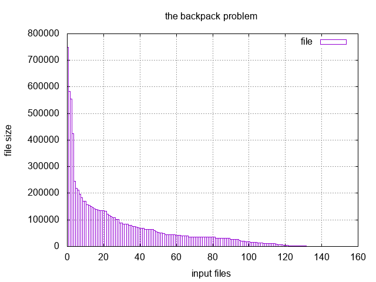

= VL10 Randomized Algorithms
7. February

== Agenda

- Las Vegas and Monte Carlo
- Genetic Algorithms (GA)

== Las Vegas and Monte Carlo

- *Las Vegas* are randomized algorithms that always give the correct result but
  can be very resource-intensive.

- *Monte Carlo* is a class of randomized algorithms that use repeated sampling to
  approximate the exact solution.

[source,c]
----
/* Las Vegas algorithm */
while(true) {

    k = RandomInteger(a.length);

    if ( a[k] == 1 )
        return k;
}

/* Monte Carlo algorithm */
nr_samples = 500;

while(nr_samples > 0) {

    k = RandomInteger(a.length);

    if ( a[k] == 1 )
        return k;

    nr_samples--;
}

throw new Exception("Algorithm failed!");
----

.Estimate the Value of Pi
[source,c]
----
n     = 1000000;
count = 0;

for ( i = 0 ; i < n ; i++ ) {

    x = RandomInteger(2) - 1;
    y = RandomInteger(2) - 1;

    if ( x * x + y * y < 1 ) {
        count++;
    }
}

print( "pi = ", 4 * count / n );
----

== Genetic Algorithms

- Class of evolutionary algorithms that uses techniques inspired by evolutionary
  biology such as inheritance, recombination, mutation, and selection

. The evolution starts with a population of randomly generated individuals.
The result of this step is called *generation*.

. *Fitness* of each individual is computed and evaluated. If desired fitness is
reached, the algorithm terminates.

. Regarding to their fitness, multiple individuals are selected to form a new
generation. New individuals are created using recombination and mutation.

. Go to 2

.Chromosome

- Chromosome is the basic descriptive data element of an individual, usually
  stored as vector data
  * binary number
  * array of integers, letters, etc.

- Every chromosome represents a single solution candidate for the problem.

.Fitness

- The fitness function quantifies the similarity of an individual with the optimal
  solution.

.Selection

- Arbitrary
- Ranking
- Tournament
- Roulette wheel

.Recombination, Mutation

- Recombination takes typically two chromosomes and produces a new chromosome.
  * Systematically
  * Or in any different manner

- Mutation is operation that randomly changes information of a chromosome.
  * Useful to escape from local maximum

== Example: Bit Count

Maximize the number of non-zero bits in a word (16 bit integer value).

. Generate 4 random integers (4 is the population size)
. Compute fitness for each, terminate if fitness reaches 16
. Keep the first two with best fitness for the next generation
. Drop the other two
. Create third via recombination of 1st and 2nd
. Create fourth via mutation of 1st (change one bit)
. Go to 2

----
iteration = 0
          { 'fitness' => 9, 'code' => 47459 },
          { 'fitness' => 8, 'code' => 59202 },
          { 'code' => 46946 },
          { 'code' => 47427 }
iteration = 1
          { 'fitness' => 9, 'code' => 47459 },
          { 'code' => 46946, 'fitness' => 9 },
          { 'code' => 46946 },
          { 'code' => 39267 }
iteration = 2
          { 'fitness' => 9, 'code' => 47459 },
          { 'code' => 46946, 'fitness' => 9 },
          { 'code' => 46946 },
          { 'code' => 39267 }
iteration = 3
          { 'fitness' => 9, 'code' => 47459 },
          { 'code' => 46946, 'fitness' => 9 },
          { 'code' => 46946 },
          { 'code' => 63843 }
iteration = 4
          { 'fitness' => 10, 'code' => 63843 },
          { 'fitness' => 9, 'code' => 47459 },
          { 'code' => 63843 },
          { 'code' => 61795 }
iteration = 5
          { 'fitness' => 10, 'code' => 63843 },
          { 'fitness' => 10, 'code' => 63843 },
          { 'code' => 63843 },
          { 'code' => 63779 }
iteration = 6
          { 'fitness' => 10, 'code' => 63843 },
          { 'fitness' => 10, 'code' => 63843 },
          { 'code' => 63843 },
          { 'code' => 63811 }
.
.
.
iteration = 42
          { 'fitness' => 16, 'code' => 65535 },
          { 'code' => 65519, 'fitness' => 15 },
          { 'code' => 65535 },
          { 'code' => 64511 }

all done, maximum found
----

== Example: The Backpack Problem

Find a subset of objects that fit into a backpack with given capacity.

Example: target capacity 1.44 MB, files in the '/bin' directory

.Chromosome
Binary string, 1 for file that's included, 0 for file that's excluded.

.Fitness Function
Sum of files that are included. Individuals with sum higher than target capacity
are not fit.

.Convergence
----
Fit: 1 not-fit: 99  best: 0.737444774624838
1/100 Mutating 99 candidates.
Fit: 43 not-fit: 57  best: 0.994665382738092
2/100 Mutating 57 candidates.
Fit: 45 not-fit: 55  best: 0.994665382738092
3/100 Mutating 55 candidates.
Fit: 58 not-fit: 42  best: 0.994665382738092
Dropping 8 candidates.
4/100 Mutating 50 candidates.
Fit: 61 not-fit: 39  best: 0.994665382738092
Dropping 11 candidates.
5/100 Mutating 50 candidates.
Fit: 57 not-fit: 43  best: 0.994665382738092
Dropping 7 candidates.
6/100 Mutating 50 candidates.
Fit: 54 not-fit: 46  best: 0.994665382738092
.
.
.
96/100 Mutating 50 candidates.
Fit: 55 not-fit: 45  best: 0.999981456327333
Dropping 5 candidates.
97/100 Mutating 50 candidates.
Fit: 53 not-fit: 47  best: 0.999981456327333
Dropping 3 candidates.
98/100 Mutating 50 candidates.
Fit: 51 not-fit: 49  best: 0.999981456327333
Dropping 1 candidates.
99/100 Mutating 50 candidates.
Fit: 52 not-fit: 48  best: 0.999981456327333
----
